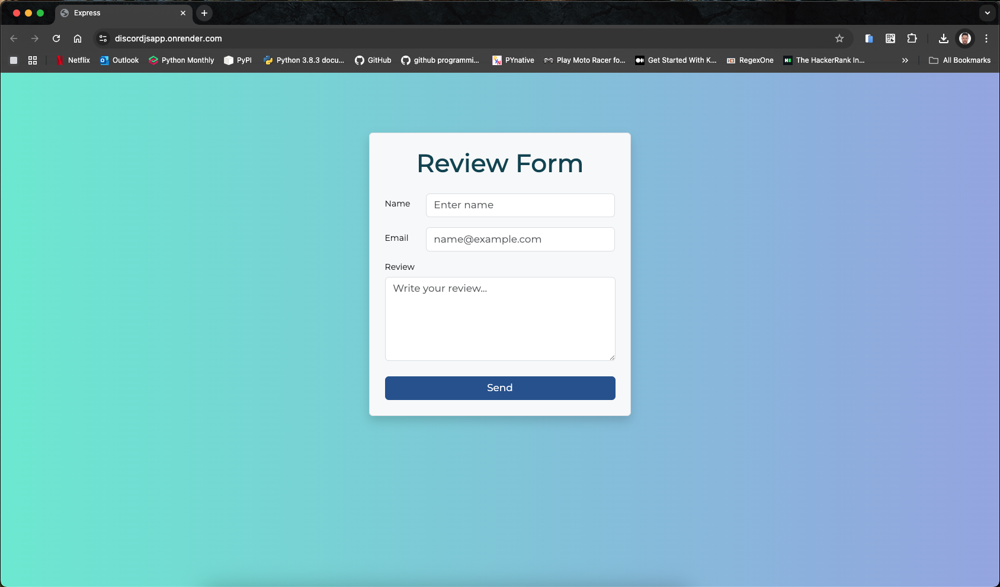
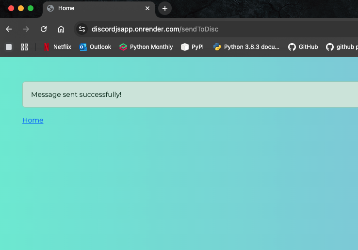

# DicordJSapp
This is a simple Discord bot application built with Node.js and Express. It allows users to send messages to a Discord channel through a web interface.

# Link 
[Review Form](https://discordjsapp.onrender.com/)

## Features
- Send messages to a Discord channel
- Simple web interface using Handlebars for templating
- Error handling for message sending failures
- Validation of user input
- Responsive design with Bootstrap

## Installation
1. Clone the repository:
    ```bash
    git clone https://github.com/yourusername/DiscordJSapp.git
    ```
2. Navigate to the project directory:
    ```bash
    cd DiscordJSapp
    ```
3. Install the dependencies:
    ```bash
    npm install
    ```
4. Create a `.env` file in the root directory and add your Discord bot token:
    ```bash
    DISCORD_BOT_TOKEN=your_bot_token
    ```
5. Start the application:
    ```bash
    npm start
    ```
6. Open your browser and go to `http://localhost:3000` to access the application.

## Usage
- Fill out the form with your name, email, and message.
- Click the "Send" button to send the message to the Discord channel.
- If the message is sent successfully, you will see a success message.
- If there is an error, an error message will be displayed.
- You can navigate back to the home page using the link provided in the success message.
- The application uses Handlebars for rendering views, so you can customize the templates as needed.
- The application is structured with routes for handling requests and a separate module for sending messages to Discord.
- The application uses Bootstrap for responsive design, ensuring it looks good on both desktop and mobile devices.

## Contributing
Contributions are welcome! If you find a bug or have a feature request, please open an issue or submit a pull request.

## Acknowledgements
- [Discord.js](https://discord.js.org/) for the Discord bot framework
- [Express](https://expressjs.com/) for the web framework
- [Handlebars](https://handlebarsjs.com/) for templating
- [Bootstrap](https://getbootstrap.com/) for responsive design

## Authors
- [NibrasKhalid](https://github.com/NibrasKhalid)
- [RyanPatton8](https://github.com/RyanPatton8)
- [Pipetr](https://github.com/Pipetr)
- [Wadih-Roy](https://github.com/Wadih-Roy)


## Interface
Home page interface with a form to send messages to Discord.



## Message Sent Confirmation
After sending a message, a confirmation page is displayed.



## Discord Channel
Messages sent to the Discord channel will appear here.


